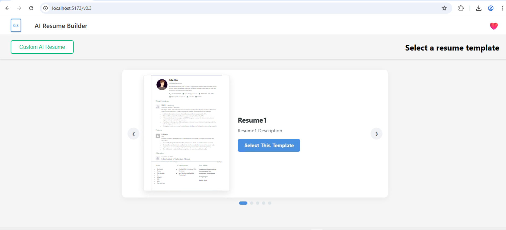
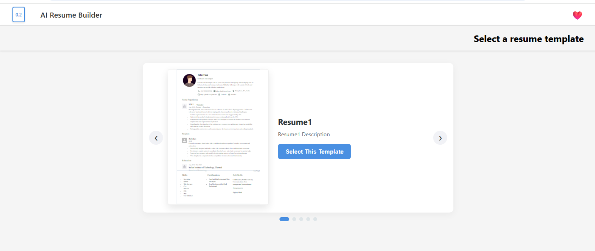

# 🚀 AI React Resume Builder

<div align="center">
  
  
  <p align="center">
    <strong>A high-performance, version-controlled React application for crafting professional resumes with real-time feedback, custom styling, and high-fidelity PDF export.</strong>
  </p>
  
  <div align="center">
    
    
    
    
  </div>
</div>

---

## ✨ Key Features

### 🛠️ Professional Editing Suite
- ✏️ **Dynamic CRUD**: Full control over every resume segment with instant state synchronization.
- 🖼️ **Asset Support**: Personal branding with high-quality profile image uploads.
- 🧩 **Modular Sections**: Native support for Experience, Projects, Education, Skills, and more.
- ➕ **Custom Architecture**: Create, reorder, and toggle bespoke sections tailored to your career path.

### 🎨 Design & Customization
- 👁️ **Pixel-Perfect Preview**: Side-by-side editing with immediate visual feedback.
- 📥 **Advanced PDF Engine**: Multi-page aware PDF generation with automated content slicing to prevent text cutoff.
- 📐 **Granular Styling**: User-adjustable margins, padding, font sizes, and professional font family selection.
- 📱 **Fully Responsive**: Seamlessly switch between desktop JSON editing and mobile form filling.

### 🔄 Evolution System (Versioning)
- 🔢 **Multi-Phase Architecture**: Explore the application's growth through 5 distinct iterations (v0.1 to v0.5).
- 🔀 **State Isolation**: Each version maintains its own logic, routing, and specific UI enhancements.
- 📋 **Integrated Navigator**: Swift version switching via a custom dropdown system.

---

## 📸 Evolution Showcase

The AI Resume Builder has evolved significantly. Below are the snapshots of the major milestones:

### 🌟 Version 0.3 (Current Milestone)
*Optimized UI with side-by-side editing, AI integration, and advanced styling controls.*
<div align="center">
  
</div>

### 📘 Version 0.2
*Focused on template selection and improved layout management.*
<div align="center">
  
</div>

### 📁 Version 0.1
*The foundational architecture supporting dynamic sections and core PDF features.*
<div align="center">
  
</div>

---

## 🚀 Getting Started

### Prerequisites
- **Node.js** (v18 or higher recommended)
- **npm** or **pnpm**

### Installation
1. **Clone the repository**
   ```bash
   git clone https://github.com/muhammad-waqar-dev/AI-React-Resume-Builder-App.git
   cd AI-React-Resume-Builder-App
   ```

2. **Install dependencies**
   ```bash
   npm install
   ```

3. **Launch Development Server**
   ```bash
   npm run dev
   ```

---

## 📁 Project Architecture

```text
src/
├── components/
│   ├── MainHeader/        # Version-aware global navigation
│   ├── ResumeForm/        # Dynamic section orchestration
│   ├── ResumePreview/     # Advanced PDF & styling engine
│   ├── SectionManager/    # Drag-and-drop visibility controls
│   ├── JSON-Editor/       # Tree-view & Code-based data manipulation
│   ├── forms/             # Atomic section form components
│   └── AIResumeModal/     # AI-assisted parsing interface
├── versions/              # Isolated version snapshots (v0.1 - v0.5)
├── Config-Data/           # Resume templates and data schemas
└── utils/                 # Data parsers and PDF generation logic
```

---

## 🛠️ Tech Stack

- **Framework**: [React 18](https://reactjs.org/)
- **Build Tool**: [Vite](https://vitejs.dev/)
- **Routing**: [React Router 7](https://reactrouter.com/)
- **PDF Rendering**: [jsPDF](https://github.com/parallax/jsPDF) & [html2canvas](https://html2canvas.hertzen.com/)
- **Typography**: Inter, Poppins, Roboto, Lato (Google Fonts)

---

## 🔗 Connect & Support

- **LinkedIn**: [Muhammad Waqar](https://www.linkedin.com/in/muhammad-waqar-dev/)
- **Live Demo**: [ai-resume-builder-latest.netlify.app](https://ai-resume-builder-latest.netlify.app/)

<div align="center">
  <br/>
  <p>If you find this project useful, please consider giving it a ⭐ on GitHub!</p>
  <br/>
  <p><strong>Made with ❤️ by Muhammad Waqar</strong></p>
</div>
