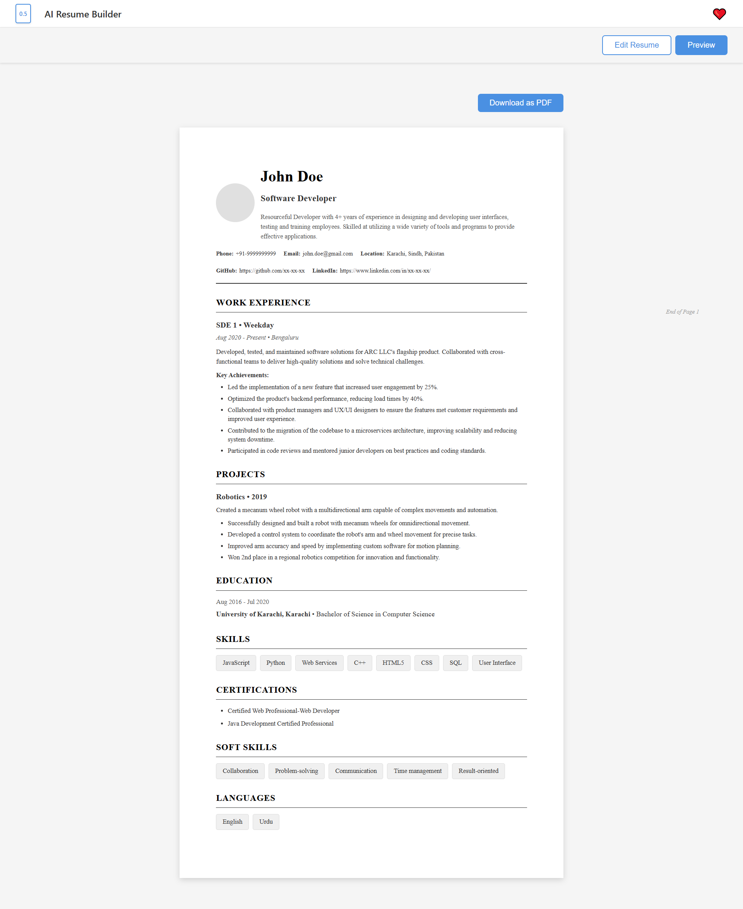

# 🚀 AI React Resume Builder

<div align="center">
  
  
  <p align="center">
    <strong>A modern, feature-rich React application for building professional resumes with advanced versioning, CRUD functionality, and PDF export capabilities.</strong>
  </p>
  
  [](https://reactjs.org/)
  [](https://vitejs.dev/)
  [](LICENSE)
</div>

---

## ✨ Features

### 🎯 Core Functionality
- ✏️ **Full CRUD Operations**: Create, Read, Update, and Delete all resume sections
- 📄 **Comprehensive Resume Sections**:
  - Personal Information (with profile image support)
  - Work Experience (with achievements)
  - Projects (with detailed descriptions)
  - Education
  - Skills
  - Certifications
  - Soft Skills
  - Languages
- ➕ **Custom Sections**: Create unlimited custom sections (Awards, Publications, Hobbies, etc.)
- 🎛️ **Section Management**: 
  - Reorder sections with drag-and-drop functionality
  - Show/hide sections dynamically
  - Add or remove sections on the fly

### 🎨 User Interface
- 👁️ **Live Preview**: Real-time preview of your resume as you type
- 📥 **PDF Export**: Download your resume as a high-quality PDF
- 🎨 **Modern UI**: Clean, intuitive, and responsive user interface
- 📱 **Mobile Responsive**: Fully optimized for all screen sizes

### 🔄 Versioning System
- 🔢 **Multi-Version Support**: Access versions 0.1 through 0.5
- 🔀 **URL-Based Routing**: Each version has its own URL (`/v0.5`, `/v0.4`, etc.)
- 📋 **Version Selector**: Easy dropdown navigation between versions
- 🎨 **Version-Specific Styling**: Each version can have its own look and feel
- 📁 **Organized Codebase**: Version-specific code organized in separate folders

### 🎯 Advanced Features
- 🔗 **LinkedIn Integration**: Quick access to developer's LinkedIn profile
- 💾 **State Management**: Efficient React state management for all resume data
- 🎯 **Section Ordering**: Customize the order of sections in your resume
- 👁️ **Visibility Control**: Toggle section visibility without deleting data

---

## 📸 Screenshots

<div align="center">
  
</div>

---

## 🚀 Getting Started

### Prerequisites

- **Node.js** (v14 or higher)
- **npm** or **yarn**

### Installation

1. **Clone the repository**
   ```bash
   git clone <your-repo-url>
   cd AI-React-Resume-Builder-App
   ```

2. **Install dependencies**
   ```bash
   npm install
   ```

3. **Start the development server**
   ```bash
   npm run dev
   ```

4. **Open your browser**
   Navigate to `http://localhost:5173`

### Building for Production

```bash
npm run build
```

The production build will be created in the `dist` folder.

---

## 📖 Usage Guide

### Basic Workflow

1. **Select Version**: Use the version dropdown (top-left) to choose your preferred version (v0.1 - v0.5)

2. **Edit Resume**: 
   - Click on "Edit Resume" tab
   - Fill in your personal information
   - Add work experience, projects, education, etc.
   - Use "Add" buttons to add multiple entries

3. **Manage Sections**:
   - Click "Manage Sections" to expand section management panel
   - Reorder sections using up/down arrows
   - Toggle section visibility with the eye icon
   - Add new sections or create custom sections

4. **Preview**: 
   - Switch to "Preview" tab to see your resume in real-time
   - All changes are reflected immediately

5. **Download PDF**: 
   - Click "Download as PDF" button in the preview
   - Your resume will be exported as a high-quality PDF

### Advanced Features

#### Creating Custom Sections
1. Expand "Manage Sections" panel
2. Scroll to "Create Custom Section"
3. Enter a section name (e.g., "Awards", "Publications")
4. Click "Create"
5. The new section will appear in your resume

#### Reordering Sections
1. Expand "Manage Sections" panel
2. Use the ↑ and ↓ buttons to move sections up or down
3. Changes are reflected immediately in the preview

#### Version Navigation
- Use the version selector (document icon) in the top-left corner
- Select any version from 0.5 (latest) to 0.1
- The URL will update automatically
- Each version maintains its own styling and features

---

## 📁 Project Structure

```
AI-React-Resume-Builder-App/
├── public/
│   └── app-image.png          # Application screenshot
├── src/
│   ├── components/
│   │   ├── forms/             # Form components for each section
│   │   │   ├── PersonalInfoForm.jsx
│   │   │   ├── WorkExperienceForm.jsx
│   │   │   ├── ProjectsForm.jsx
│   │   │   ├── EducationForm.jsx
│   │   │   ├── SkillsForm.jsx
│   │   │   ├── CertificationsForm.jsx
│   │   │   ├── SoftSkillsForm.jsx
│   │   │   ├── LanguagesForm.jsx
│   │   │   └── CustomSectionForm.jsx
│   │   ├── ResumeForm.jsx     # Main form container
│   │   ├── ResumePreview.jsx  # Resume preview component
│   │   ├── SectionManager.jsx # Section management component
│   │   └── VersionSelector.jsx # Version selector dropdown
│   ├── versions/              # Version-specific App components
│   │   ├── v0.1/
│   │   │   └── App.jsx
│   │   ├── v0.2/
│   │   │   └── App.jsx
│   │   ├── v0.3/
│   │   │   └── App.jsx
│   │   ├── v0.4/
│   │   │   └── App.jsx
│   │   └── v0.5/
│   │       └── App.jsx
│   ├── Config-Data/
│   │   └── Resume-1.js        # Initial resume data and configuration
│   ├── App.jsx                # Main routing component
│   ├── App.css               # Application styles
│   ├── main.jsx              # Application entry point
│   └── index.css             # Global styles
├── package.json
├── vite.config.js
└── README.md
```

---

## 🛠️ Technologies Used

- **React 18.2.0** - UI library
- **Vite 5.0.8** - Build tool and dev server
- **React Router DOM 7.11.0** - Client-side routing
- **jsPDF 2.5.1** - PDF generation
- **html2canvas 1.4.1** - HTML to canvas conversion for PDF

---

## 🎯 Key Features Breakdown

### Versioning System
- **5 Versions Available**: v0.1 through v0.5
- **URL-Based Navigation**: Each version accessible via `/v0.X`
- **Version Selector**: Document icon dropdown in header
- **Isolated Code**: Each version in its own folder

### Section Management
- **Dynamic Reordering**: Change section order with up/down buttons
- **Visibility Toggle**: Show/hide sections without deleting
- **Custom Sections**: Create unlimited custom sections
- **Required Sections**: Personal Info always required and first

### Resume Sections
- **Personal Info**: Name, title, summary, contact details, profile image
- **Work Experience**: Company, role, dates, description, achievements
- **Projects**: Name, year, description, details
- **Education**: Institution, degree, dates
- **Skills**: Tag-based display
- **Certifications**: List format
- **Soft Skills**: Tag-based display
- **Languages**: Tag-based display

---

## 🔗 Links

- **LinkedIn Profile**: [Muhammad Waqar](https://www.linkedin.com/in/muhammad-waqar-dev/)
  - Click the ❤️ icon in the header to visit!

---

## 📝 License

This project is licensed under the MIT License.

---

## 👨‍💻 Developer

**Muhammad Waqar**
- LinkedIn: [muhammad-waqar-dev](https://www.linkedin.com/in/muhammad-waqar-dev/)

---

## 🤝 Contributing

Contributions, issues, and feature requests are welcome! Feel free to check the issues page.

---

## ⭐ Show Your Support

If you find this project helpful, please give it a ⭐ on GitHub!

---

<div align="center">
  <p>Made with ❤️ by Muhammad Waqar</p>
  <p>Built with React, Vite, and lots of ☕</p>
</div>
